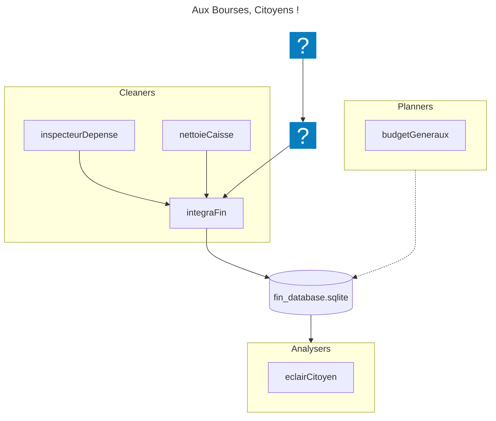

# Welcome to Aux Bourses, Citoyens! 

This is a quick markdown to show how the component pieces of the _**Aux Bourses, Citoyens!**_ are related.

```mermaid

---
title: Aux Bourses, Citoyens !
---
flowchart TB

%% Definitions
mod_1[budgetGeneraux]
mod_2[integraFin]
mod_3[inspecteurDepense]
mod_4[nettoieCaisse]
mod_5[eclairCitoyen]
db[(fin_database.sqlite)]

%% Subgraphs
subgraph Cleaners
      mod_3
      mod_4
      mod_2

      mod_3 --> mod_2
      mod_4 --> mod_2
end

subgraph Analysers
      mod_5
end

subgraph Planners
      mod_1
end


%% Mappings
Planners -..-> db
mod_2 --> db
db --> Analysers

salem --> csv --> mod_2

salem@{ icon: "fa:user", pos: "b", h: 1}

csv@{ icon: "fa:file"}

```
